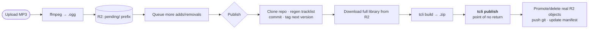

# TheFieldMixtape

**A self-service publishing pipeline for a community game mod.** A small group of friends drag an MP3 into a web page; a couple of minutes later a new version of a real, public game mod is live on Thunderstore — converted, stored, versioned, tagged, packaged, and published. No Git, no pull request, no maintainer in the loop.

**[▶ Try the live app](https://thefieldmixtape.onrender.com)** — there's a one-click **Demo** button, no credentials needed. A demo session walks the entire real workflow end to end and is forced server-side into an isolated dry-run, so it can never touch production data. Once you're in, **How it works** in the bottom bar is a guided tour written for two audiences at once.

**[📦 The mod it publishes](https://thunderstore.io/c/peak/p/TheField/TheFieldMixtape/)** — a crowd-sourced in-game mixtape for the game *PEAK*, played by the `onlystar-sPEAKer` mod.

> **Note on this repo's shape:** the repository root *is* the Thunderstore package — everything at root gets zipped and uploaded. The mod's own listing text and tracklist live in **[`THUNDERSTORE.md`](THUNDERSTORE.md)** (auto-generated; `thunderstore.toml` points the packager at it). This file describes the application that does the publishing, which lives in [`.contribute-app/`](.contribute-app) and is dot-prefixed specifically so it's excluded from the package.

---

## At a glance

| | |
|---|---|
| **Stack** | Node.js 20 · Express · EJS (server-rendered) · vanilla client JS — no SPA framework |
| **Storage** | Cloudflare R2 (S3-compatible) for audio **and** state — no database |
| **Infra** | Docker on Render · a separate Cloudflare Worker · ffmpeg · Thunderstore's `tcli` |
| **Tests** | 292, via Node's built-in `node:test` — no test framework in the dependency tree |
| **Dependencies** | 6 runtime packages, total |
| **Size** | ~9,700 lines across app, tests, views, and CSS |
| **Status** | Live and in real use; real publishes and deletions have gone out through it |

## The problem it solves

Adding a track used to mean opening a pull request against this repo: a hard stop for non-technical friends, and slow even for technical ones — a maintainer had to notice it, review it, merge it, and wait on CI to republish. The app collapses that into a login and a file picker, and makes the publish happen *now* rather than whenever someone gets around to it.

That meant owning the whole lifecycle: design, build, test, deploy, monitor, and keep it running after "done."

## How a submission actually works



Everything left of `tcli publish` touches only a throwaway clone and reads R2; nothing permanent has changed yet. That ordering is the single most important design decision in the codebase, and it's there because of an incident — see below.

## Engineering decisions worth a look

**The pipeline order is a rewrite, not a first draft.** The original version mutated R2 and pushed to Git *before* calling the registry. When that call failed downstream for unrelated reasons, a real batch of tracks ended up promoted-but-not-published — permanently inconsistent, and it took a real debugging session (with a throwaway diagnostic endpoint that captured the raw HTTP response, because the packaging tool's own error text was useless) to untangle. Patching the specific idempotency gaps would have worked. Reordering the pipeline so that entire *class* of failure can't occur was the better fix: a failed publish now leaves genuinely nothing changed, so retrying is just re-running from a clean slate. Anything that fails *after* the registry has the update is reported as a non-fatal bookkeeping error, not a failure — the user's change did ship either way.
→ [`.contribute-app/src/publish.js`](.contribute-app/src/publish.js)

**No database, on purpose.** A single `manifest.json` object in R2 is the whole persistence layer — live tracks and pending deletions — read fresh and rewritten on every mutating request. At this scale (one instance, tens of tracks, a handful of users) a database would be infrastructure to operate, not a capability gained.
→ [`.contribute-app/src/manifest.js`](.contribute-app/src/manifest.js)

**Concurrency handled by being honest about the deployment.** The app assumes exactly one running instance — true by default on Render's free/starter tiers — and builds on that rather than pretending otherwise: an in-process mutex serializes everything that touches the manifest, and a single-user "edit lock" (5-minute idle expiry, 30-second are-you-still-there warning, released immediately on logout) stops two people from building conflicting batches at once. Stating the assumption in the design beats a distributed-locking scheme nothing here needs.
→ [`.contribute-app/src/queue.js`](.contribute-app/src/queue.js), [`.contribute-app/src/editLock.js`](.contribute-app/src/editLock.js)

**Live collaboration without a client framework.** Anyone not holding the edit lock polls a fragment endpoint every 10 seconds and swaps in freshly server-rendered HTML — the *same* EJS partial the full page uses, so there's exactly one source of truth for what the queue looks like and no parallel client-side rendering to keep in sync. Whoever holds the lock never polls: their own actions already refresh that fragment, and polling would wipe out their in-progress form input.

**Limits enforced, not assumed.** A 50-track cap and an 8MB-per-converted-file cap, checked at submit time *and* again immediately before a real publish as a final safety net. A monthly bandwidth budget is metered in R2 and locks out real publishing at a deliberate margin below the host's outbound cap — every publish uploads the entire package (registry versions are immutable full zips, not diffs), so that upload, not the download side, is the real cost.
→ [`.contribute-app/src/bandwidth.js`](.contribute-app/src/bandwidth.js)

**A dry-run mode that's genuinely isolated.** A separate R2 key prefix, a separate Git branch, and a separate tag prefix let the entire real pipeline run end to end — including from the public demo login — without any possibility of polluting the real library, Git history, or version sequence.

**When the network is the bug.** Discord notifications started failing with 429s. The cause turned out not to be Discord's rate limiter at all: logging the *entire* raw response instead of the curated fields revealed a Cloudflare HTML block page, and a brand-new webhook reproduced the identical countdown — proving the block was scoped to the host's shared outbound IP, not the credential. No amount of retry logic routes around an IP ban, and the host's dedicated-IP add-on was $100/month. The fix was a 67-line Cloudflare Worker that relays from Cloudflare's own edge, holds the real webhook as its own secret, and is gated behind a shared header secret so a leaked URL can't be used as an open relay.
→ [`.contribute-app/src/discord.js`](.contribute-app/src/discord.js), [`.contribute-app/discord-relay-worker/`](.contribute-app/discord-relay-worker)

**UX choices that are engineering choices.** Removing a track is reversible right up until publish, so there are no "are you sure?" dialogs anywhere — undo does that job better. Uploads guess title and artist from the filename to save typing, but always leave the fields editable. Progress during the 1–2 minute publish is streamed live over Server-Sent Events with real per-stage weighting, because a spinner for two minutes reads as a hang.

## Design

The UI is a cassette tape: a shell-shaped card with hub circles and a rotated cream label strip, dark-only by deliberate choice, with typography scoped per purpose (a handwriting face *only* inside the label strip, a monospace *only* for numbers and timers). Designed as static HTML mockups first — those are checked in under [`design/`](design) alongside the written spec — then built.

## Repository layout

```
.contribute-app/          the web app (dot-prefixed → excluded from the package)
  src/                    pipeline, storage, manifest, auth, locking, publishing
  routes/  views/  public/  Express routes, EJS templates, CSS + client JS
  test/                   292 tests, node:test
  discord-relay-worker/   separately deployed Cloudflare Worker
design/                   HTML mockups + the written design spec
.github/workflows/        legacy tracklist sync for the older PR-based flow
THUNDERSTORE.md           the mod's own README — packaged and published
thunderstore.toml         package metadata; source of truth for the build
my mixtape/               mixtape metadata (audio lives in R2, never in Git)
```

## Running it locally

```bash
cd .contribute-app
npm install
cp .env.example .env    # fill in R2, Git, and Thunderstore credentials
npm run dev             # loads .env via Node's native --env-file
npm test                # 292 tests, no network or credentials needed
```

`ffmpeg` and Thunderstore's `tcli` need to be on `PATH` for a full pipeline run — the Dockerfile shows exactly how both are provisioned in production. Set `DISABLE_BANDWIDTH_TRACKING=true` locally: the host's bandwidth cap only meters the host's own servers, so a local run structurally can't consume any of it.

## Known limitations

Kept here deliberately rather than quietly omitted:

- **Package size ceiling.** The packaging tool OOM-crashes on the host's 512MB container somewhere around 220–250MB during upload. The track cap mitigates it but isn't a guaranteed fix. The planned solution is splitting the mixtape into a thin "master" package plus byte-capped "part" packages via the registry's native dependency mechanism — no change needed in the consuming mod.
- **Publish history.** The manifest reserves a slot for a publish log and the pipeline already computes everything it would hold, but neither the write nor the page to read it back is built yet.
- **The legacy PR flow.** `.github/CONTRIBUTING.md` still describes the old pull-request path, which no longer auto-publishes on merge.
